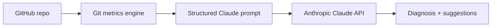
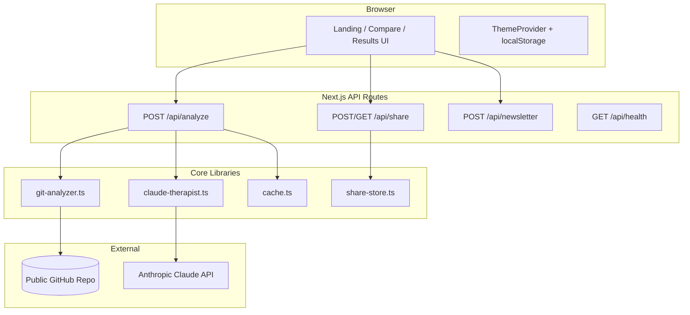
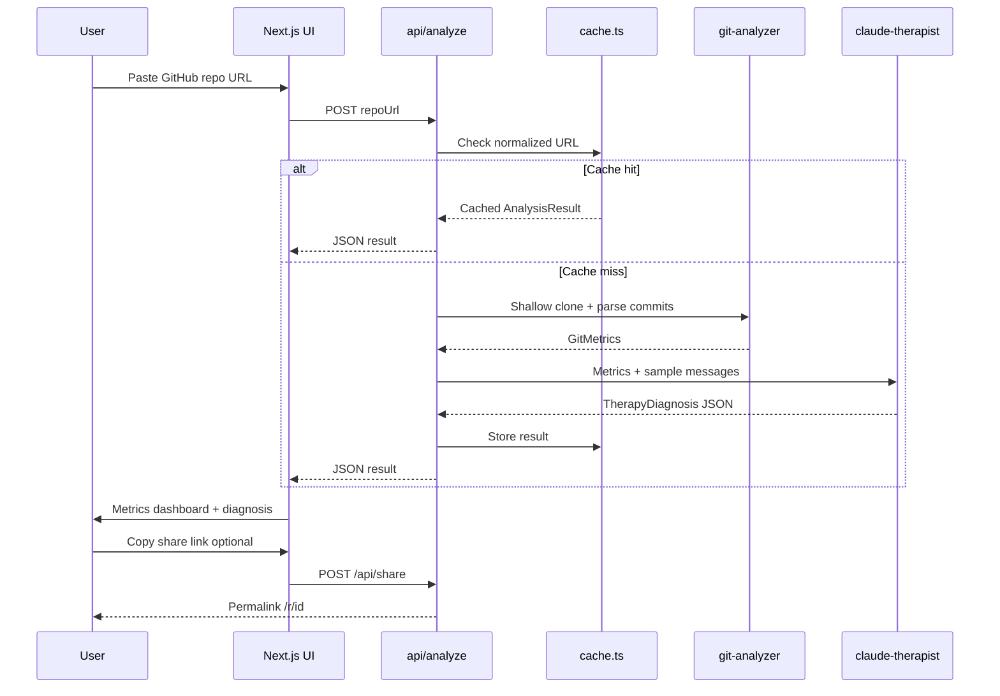

# Commit Message Therapist

[](https://github.com/BlackBeanEagles/Commit-Message-Therapist)
[](LICENSE)

**Your code deserves mental health support.**

AI therapist analyzes your Git history and generates witty mental health diagnoses. Paste a public GitHub repo URL — we clone it, extract real Git metrics, and Claude generates a personalized therapy session.

**Repository:** [github.com/BlackBeanEagles/Commit-Message-Therapist](https://github.com/BlackBeanEagles/Commit-Message-Therapist)

---

## What this project does

**Commit Message Therapist** is a web app that analyzes a **public GitHub repository** and produces a structured **developer wellness report** from real commit history.

Users paste a repo URL. The app clones commit history (last ~500 commits), computes objective Git metrics (late-night work, weekends, merges, frustration keywords, burnout risk), and uses **Claude** to generate a readable diagnosis with severity, suggestions, and shareable output. No GitHub login or wallet is required.

Built for the **Injective Solo AI Builder Sprint** — an AI-first developer tool that turns invisible coding patterns into something teams can discuss.

---

## How users interact with it

| Step | User action | What happens |
|------|-------------|--------------|
| 1 | Open the app | Landing page with **Analyze** and **Compare repos** tabs |
| 2 | Paste a public GitHub URL | e.g. `https://github.com/vitejs/vite` |
| 3 | Click **Start therapy** (or Cmd/Ctrl+Enter) | Server clones history and runs analysis (~30–90s) |
| 4 | View results | Metrics grid, burnout score, severity badge, Claude diagnosis, suggestions |
| 5 | Share or export | Copy share link (`/r/{id}`), copy diagnosis, or post to X |
| 6 | *(Optional)* **Compare repos** | Enter two URLs → side-by-side metrics and diagnoses |
| 7 | *(Optional)* Featured examples / newsletter | One-click demo repos; optional email signup |

**Requirements for users:** A public GitHub repo URL and a modern browser. The server needs **Git** installed for cloning.

---

## How AI is used

AI is **not** used to guess metrics — Git computes those deterministically. **Anthropic Claude** is used only for the **natural-language diagnosis layer**.

### What is not AI
- Commit counts, late-night %, weekend %, merge counts, author stats, burnout score (1–10)
- All computed by `lib/git-analyzer.ts` from parsed Git log data

### What Claude does
1. Receives a **structured payload**: full metrics JSON + sample commit messages from the repo
2. Gets a **fixed prompt** asking for a therapy-style diagnosis tied to those numbers (not open-ended chat)
3. Returns **strict JSON**: emoji, title, multi-paragraph diagnosis, severity (`mild` → `critical`), actionable suggestions, tweet summary
4. **Model fallback**: tries `CLAUDE_MODEL` from env, then `claude-sonnet-4-6` if the preferred model fails
5. **Fallback mode**: if no `ANTHROPIC_API_KEY`, a rule-based template diagnosis is used so demos still work



**Why this design:** Every claim in the diagnosis should trace back to real repo numbers — AI interprets data, it does not invent it.

---

## Injective integration

| Question | Answer |
|----------|--------|
| **Is Injective integrated?** | **No on-chain integration** in the current version |
| **Relation to Injective** | Submitted as an entry for the **Injective Solo AI Builder Sprint** |
| **Wallet / smart contracts** | Not used — no Injective SDK, wallet connect, or chain transactions |
| **Future fit** | Diagnosis results could be anchored on-chain (e.g. verifiable repo wellness attestations) or tied to Injective ecosystem tooling in a later iteration |

This sprint focuses on **AI + Git analysis** as a standalone developer tool. Injective is the **hackathon context**, not a runtime dependency.

---

## Motivation

Developers leave emotional fingerprints in Git: late-night commits, weekend pushes, merge-conflict rage, and messages like `fix fix fix please work`. Those patterns are real signals of workload and stress — but they are buried in thousands of commits and rarely discussed in retros.

**Commit Message Therapist** makes that invisible history visible and approachable. Instead of another dry dashboard, it reframes repo health as a therapy session: humorous enough to share, grounded enough to spark real conversations about boundaries, burnout, and team habits.

## Inspiration

- **Commit messages as mood rings** — `wip`, `finally`, and `revert revert` tell a story metrics alone cannot.
- **Developer wellness** — burnout is a people problem; Git history is an honest (if imperfect) mirror.
- **AI with receipts** — Claude does not guess; it interprets *your* numbers (late-night %, weekend load, author skew) so the diagnosis feels personal, not generic.

---

## Architecture

The app is a **Next.js 15** full-stack application: React UI, API routes for analysis, and a Git + Claude pipeline on the server.



### Layer responsibilities

| Layer | Role |
|-------|------|
| **`app/`** | Pages, API routes, global styles |
| **`components/`** | UI: metrics, diagnosis, theme, compare, featured examples |
| **`lib/git-analyzer.ts`** | Shallow clone, parse log, compute burnout and pattern metrics |
| **`lib/claude-therapist.ts`** | Structured prompt → JSON diagnosis; rule-based fallback without API key |
| **`lib/cache.ts`** | In-memory URL cache (1h TTL) for instant re-analysis |
| **`lib/share-store.ts`** | In-memory share IDs (7d TTL) for permalink results |

---

## Workflow

End-to-end flow from URL paste to shareable therapy session:



### Analysis pipeline (detail)

1. **Validate URL** — `github-url.ts` parses owner/repo and normalizes the link.
2. **Clone** — Shallow clone (last ~500 commits) into a temp directory via `simple-git`.
3. **Extract metrics** — Late-night %, weekends, merges, frustration keywords, author distribution, burnout score (1–10).
4. **Generate diagnosis** — Metrics sent to Claude with a strict JSON schema; fallback rules if no API key.
5. **Present & share** — Dashboard with severity badges; optional permalink via `/r/{id}`.

> See **How AI is used** and **How users interact with it** above for submission-ready summaries.

---

## Features

- Single URL input → full analysis in ~30–60s
- Metrics dashboard: commits, late-night %, weekends, merges, burnout score
- **Colored severity indicators** next to burnout score and diagnosis
- AI therapy diagnosis with humor + real insights
- **Dark / light mode toggle** (persists in `localStorage`)
- **Featured diagnoses** on the landing page with one-click analyze
- **Share via link** — copy a permalink to any result (`/r/{id}`)
- **Compare repos** — side-by-side burnout and diagnosis for two codebases
- One-click **Share on X** with pre-filled tweet
- Copy diagnosis to clipboard
- **Optional newsletter signup** for product updates
- In-memory cache (same repo = instant replay)
- Cmd/Ctrl+Enter to submit
- Purple gradient UI, responsive mobile layout

---

## Quick start

```bash
git clone https://github.com/BlackBeanEagles/Commit-Message-Therapist.git
cd Commit-Message-Therapist
npm install
cp .env.example .env.local
# Add your ANTHROPIC_API_KEY to .env.local
npm run dev
```

Open [http://localhost:3000](http://localhost:3000). Requires **Git** installed locally for cloning.

### Environment variables

| Variable | Required | Description |
|----------|----------|-------------|
| `ANTHROPIC_API_KEY` | Recommended | Claude API key from [console.anthropic.com](https://console.anthropic.com/) |
| `CLAUDE_MODEL` | Optional | Default: `claude-sonnet-4-6`. Use `claude-opus-4-7` for best quality |

### Example repos to try

- https://github.com/facebook/react
- https://github.com/vercel/next.js
- https://github.com/torvalds/linux

---

## Deploy (Vercel)

1. Push to [GitHub](https://github.com/BlackBeanEagles/Commit-Message-Therapist)
2. [Import in Vercel](https://vercel.com)
3. Set `ANTHROPIC_API_KEY` in project settings
4. Use smaller public repos first — serverless has time limits; `maxDuration` is **120s** on `/api/analyze`

> **Note:** Share links and cache use in-memory storage. For production at scale, replace with Redis or a database.

---

## Project structure

```
app/
  page.tsx                 # Landing + analyze / compare UI
  r/[id]/page.tsx          # Shared result permalink
  api/analyze/route.ts     # Clone → metrics → Claude
  api/share/route.ts       # Create and fetch share links
  api/newsletter/route.ts  # Optional email signup
  api/health/route.ts      # Health check
components/                # Theme, severity, featured, compare, newsletter, results
lib/
  git-analyzer.ts          # Git clone + metrics
  claude-therapist.ts      # Claude API + fallback
  cache.ts                 # URL-based analysis cache
  share-store.ts           # Shareable result IDs
  featured-diagnoses.ts    # Landing page examples
  severity.ts              # Severity colors and mapping
  github-url.ts            # URL validation
  types.ts                 # Shared TypeScript types
```

---

## Tech stack

- **Framework:** Next.js 15, React 19, TypeScript
- **Styling:** Tailwind CSS
- **Git:** simple-git (shallow clone + log parsing)
- **AI:** Anthropic Claude (`@anthropic-ai/sdk`)

---

## License

MIT — see [LICENSE](LICENSE).
